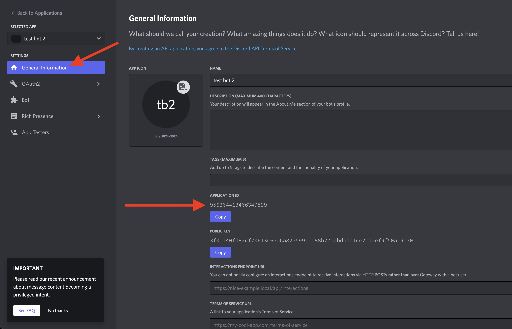
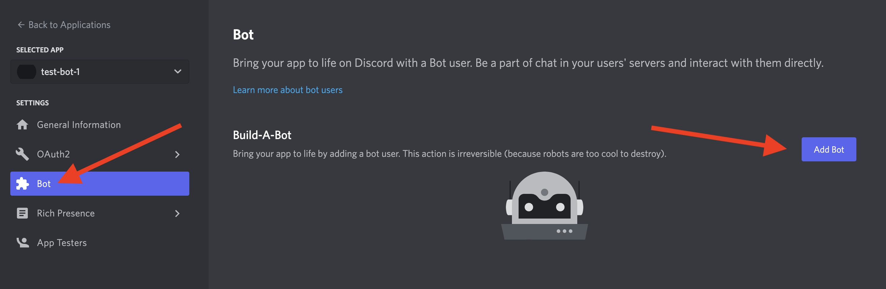

# Discord Bot Boilerplate BETA
This boilerplate is for single-tenant Discord bots (ie. installing on a single server). It also ships with a CLI tool to help you start writing your bot quickly!\
**This is currently in beta**, and features may change quickly before the stable release. Please check back here regularly for updates. Contributions are also welcome!

## Requirements
1) Node.js version 16.x+
2) Solid understanding of JavaScript
3) A Discord account, and the Discord application installed on your computer
4) Basic understanding of [how Discord.js works](https://discordjs.guide/#before-you-begin)

## Table of Contents
- [Introduction and Folder Structure](#introduction-and-folder-structure)
  - [/src/slashCommands](#srcslashcommands)
  - [/src/events](#srcevents)
- [Setting Up Your Environment](#setting-up-your-environment)
  - [Environment Variable Reference](#environment-variable-reference)
- [The Client](#the-client)
- [CLI Commands](#cli-commands)
  - [Set up your bot](#set-up-your-bot)
  - [Install the bot on your Discord server](#install-the-bot-on-your-discord-server)
  - [Run the bot in dev mode](#run-the-bot-in-dev-mode)
  - [Create a slash command](#create-a-slash-command)
  - [Create an event handler](#create-an-event-handler)
- [Supported Event Handlers](#supported-event-handlers)
  - [Common](#common)
    - [Messages](#messages)
    - [Roles](#roles)
    - [Channels](#channels)
    - [Message Reactions](#message-reactions)
    - [User Join / Leave](#user-join--leave)
    - [Threads](#threads)
    - [User Updates](#user-updates)
  - [Other Events](#other-events)
    - [Bans](#bans)
    - [Bot Ready](#bot-ready)
    - [Emojis](#emojis)
    - [Guild Join / Leave](#guild-join--leave)
    - [Guild Scheduled Events](#guild-scheduled-events)
    - [Guild Scheduled Event Members](#guild-scheduled-event-members)
    - [Guild Update](#guild-update)
    - [Invites](#invites)
    - [Ping](#ping)
    - [Shards](#shards)
    - [Stages](#stages)
    - [Stickers](#stickers)
    - [Thread Members](#thread-members)
    - [Typing Start](#typing-start)
    - [User Presence](#user-presence)
    - [Voice](#voice)
    - [Webhooks](#webhooks)
- [Common Patterns](#common-patterns)
  - [Responding to a user's interaction in a slash command](#responding-to-a-users-interaction-in-a-slash-command)
  - [Editing a bot's response in a slash command](#editing-a-bots-response-in-a-slash-command)
  - [Sending a message to a channel after an interaction event](#sending-a-message-to-a-channel-after-an-interaction-event)
  - [Responding to a message with some text and an action button from an interaction event](#responding-to-a-message-with-some-text-and-an-action-button-from-an-interaction-event)
  - [Changing a user's server nickname from a slash command](#changing-a-users-server-nickname-from-a-slash-command)
  - [Other Examples](#other-examples)
- [Manual Setup (NOT RECOMMENDED)](#manual-setup-not-recommended)
- [Installing Your Bot](#installing-your-bot)
- [Important Notes](#important-notes)
- [Contributing](#contributing)
- [In Progress](#in-progress)
- [Contact](#contact)

## Introduction and Folder Structure
This boilerplate was created to help you start writing Discord bots quickly! After you run the setup below, you can either use the CLI tool to help you generate slash commands and event listeners, or you can manually create them on your own. This boilerplate uses Discord.js to help you write slash commands and event listeners. You can learn more about how it works [here](https://discordjs.guide/#before-you-begin).\
The folder structure in this boilerplate is opinionated and will help you automatically deploy your slash commands, and mount your event listeners:

### /src/slashCommands
This is where your slash commands will live. You can either create files directly in this folder, or you can create folders in here to organize your code. When you run your project in dev or production mode, it will look for all JavaScript files under this directory, and it will deploy them to Discord so that they are available to your bot. You can either manually create files in here, OR you can use the [CLI tool](#cli-commands) to help generate files and boilerplate code that will be saved to this directory. To learn more about how Slash commands work with Discord.js, you can read about it [here](https://discordjs.guide/interactions/slash-commands.html#registering-slash-commands).

### src/events
This is where all of your [event handlers](#supported-event-handlers) will live. In this directory, you will see a list of folders that correspond to all of the events supported in Discord.js version 14. You can either manually create JavaScript files in these directories, OR you can use the [CLI tool](#cli-commands) to help generate files and boilerplate code that will be saved into the event listener that you choose. JavaScript files that live in each of the event folders will receive the corresponding event from Discord. If you have multiple files in these directories, they will all receive the event. For example, all .js files that live under the `src/events/messages` folder will trigger whenever a message is created, deleted, or updated in Discord. You can learn more about these events and the data your .js files will receive [here](#supported-event-handlers).

## Setting Up Your Environment

1) Click the "Use This Template" button to clone this repo.

2) Run `yarn` to install dependencies.
3) Run `npx discord-bot` to start the Discord bot CLI tool.
  - Using the arrow keys, select the "Set up your bot" option, and press enter. Proceed through the wizard to set up your bot's environment variables. If you have any difficulty finding keys and secrets, please check out the [environment variable reference](#environment-variable-reference) section. If you'd like to set this up without using the CLI tool, you can reference the [manual setup](#manual-setup) section.

4) If you didn't install your bot in the previous step, run `npx discord-bot` and select the "Install the bot on your Discord Server" option. Open the link in your browser, and follow the steps, and your bot will be added to your server!
5) Reference the [CLI Commands](#cli-commands) section below to start writing commands and event handlers.

## Environment Variable Reference

#### DISCORD_API_VERSION
Currently defaulted to 10. If you wish to override this, please update this in your `.env` file. For more information about supported API versions, you can check the [Discord API docs here](https://discord.com/developers/docs/reference#api-versioning).

#### DISCORD_APP_ID
After you create an application in the [Discord Developer Portal](https://discord.com/developers/applications), you can find your App ID in the "General Information" tab:


#### DISCORD_BOT_TOKEN
Navigate to the "Bot" tab. If you haven't set up your application as a bot yet, click the "Add Bot" button:


Click the "Reset Token" button, to generate a new bot token. This is what you will use for the environment variable. Also, make sure that "Presence Intent" is toggled on at the bottom of the page:


#### DISCORD_GUILD_ID
In the Discord app, make sure that "Developer Mode" is turned on in your settings:\


Next, right click on the server that you want to deploy your bot to. Click on the "Copy ID" button. Use this as your environment variable.\


## The Client
When you create slash commands and event listeners with the CLI, you'll notice that a `client` is imported into your file. You can use this to handle everything from fetching guild details, fetching a list of users and channels, responding to the user's input, sending a user a private direct message, and much more. For common usecases, see the [common patterns](#common-patterns) section.

## CLI Commands
#### Set up your bot
This is the wizard that will set up your project's .env files. The environment variables are used to help your bot communicate with your Discord server, listen for commands, and receive events!

#### Install the bot on your Discord server
If you need to run the install step again, you can use this to add your bot to your Discord server.

#### Run the bot in dev mode
You can use this to start your bot. This will deploy your commands, and listen for events. As long as your bot is installed on your server and your bot is running, you will receive events from your Discord server! You can also run dev mode without the CLI tool by running `yarn dev`.

#### Create a slash command
Slash commands let you define "actions" that users can interact with. An example of a slash command might be something like:
1) A user types `/hello`
2) The bot responds with `World!`

In the CLI tool, the "Create a slash command" option will walk you through a series of steps to create your own. It will ask you to name your command, give it a description, and optionally, add some arguments such as a string, a user, a channel, a role, etc. Once you have followed the steps in the wizard, the CLI will generate a skeleton command in `src/slashCommands/[commandName].js`. You will then be able to modify this file to add the functionality you want! To learn more about what you can do in slash commands, check out the [common patterns](#common-patterns) section.

#### Create an event handler
Event handlers let you execute code when a specific event happens. For example, when a user sends a message, adds an emoji reaction, changes their name, etc. You can reference the [full list](#supported-event-handlers) below, and when you can expect them to trigger.

In the CLI tool, the "Create an event handler" option will let you select from a list of supported events. You will be asked to give it a name, and a file will be automatically created with some boilerplate code inside of `src/events/[eventName]`. You can now modify this code to add the functionality that you want! For a full list of supported methods and data structures, you can reference the [events in the official Discord.js documentation](https://discord.js.org/#/docs/main/stable/class/Client).

## Supported Event Handlers

### Common
#### Messages
Triggers when a message is created, deleted, deleted in bulk, or updated.

##### Receives:
message: [Message](https://discord.js.org/#/docs/main/stable/class/Message)\
action: (`created`, `deleted`, `deleteBulk`, `updated`)

##### Example:
```js
const { client } = require('../../configuration/bot');

// Sample: If user sends 'ping' in a channel, the bot will respond with 'Pong'
module.exports = async (message, action) => {
  try {
    if (message.author.bot) return;

    if (message.content.toUpperCase() === 'PING') {
      const channel = await client.channels.fetch(message.channel.id);

      channel.send({
        content: 'Pong'
      });
    }

  } catch(e) {
    console.error(`Ping pong error: ${e}`);
  }
};
```

#### Roles
Triggers when a role is created, deleted, or updated.

##### Receives:
role: [Role](https://discord.js.org/#/docs/main/stable/class/Role)\
action: (`created`, `deleted`, `updated`)

##### Example:
```js
const { client } = require('../../configuration/bot');

module.exports = async (event, action) => {
  try {
    const roleId = event?.id;
    console.log(`Role ${action} event for role ID: ${roleId}`);
  } catch(e) {
    console.error(`Role event error: ${e}`);
  }
};
```

#### Channels
Triggers when a channel is created, deleted, or updated.

##### Receives:
guildChannel: [GuildChannel](https://discord.js.org/#/docs/main/stable/class/GuildChannel)\
action: (`created`, `deleted`, `updated`)

##### Example:
```js
const { ChannelType } = require('discord.js');
const { client } = require('../../configuration/bot');

module.exports = async (guildChannel, action) => {
  try {
    const channelType = ChannelType[guildChannel.type];

    switch(channelType) {
      case 'GUILD_TEXT':
        console.log('New text channel event.');
        break;
      case 'GUILD_VOICE':
        console.log('New voice channel event.');
        break;
      case 'GUILD_CATEGORY':
        console.log('New organizational category event.');
        break;
      case 'GUILD_NEWS':
        console.log('New news channel event.');
        break;
      case 'GUILD_NEWS_THREAD':
        console.log('New news channel thread event.');
        break;
      case 'GUILD_PUBLIC_THREAD':
        console.log('New text channel thread event.');
        break;
      case 'GUILD_PRIVATE_THREAD':
        console.log('New text channel private thread event.');
        break;
      case 'GUILD_STAGE_VOICE':
        console.log('New stage channel event.');
        break;
      case 'GUILD_DIRECTORY':
        console.log('New guild directory event.');
        break;
      case 'GUILD_FORUM':
        console.log('New guild forum event.');
        break;
      default:
        console.log(`Unknown channel event for type: ${channelType}`);
    }
  } catch(e) {
    console.error(`Channel event error: ${e}`);
  }
};
```

#### Message Reactions
Triggers when an emoji reaction(s) is added or removed from a message.

##### Receives:
messageReaction: [MessageReaction](https://discord.js.org/#/docs/main/stable/class/MessageReaction)\
action: (`add`, `remove`, `removeAll`)

##### Example:
```js
const { client } = require('../../configuration/bot');

module.exports = async (messageReaction, action) => {
  try {
    const messageId = messageReaction?.message?.id;
    console.log(`Message reaction ${action} for message ID: ${messageId}`);
  } catch(e) {
    console.error(`Message reaction event error: ${e}`);
  }
};
```

#### User Join / Leave
Triggers when a user joins or leaves your server.

##### Receives:
guildMember: [GuildMember](https://discord.js.org/#/docs/main/stable/class/GuildMember)\
action: (`join`, `leave`)

##### Example:
```js
const { client } = require('../../configuration/bot');

module.exports = async (guildMember, action) => {
  try {
    const userId = guildMember?.user?.id;
    console.log(`Guild ${action} event for user ID: ${userId}`);
  } catch(e) {
    console.error(`User join / leave event error: ${e}`);
  }
};
```

#### Threads
Triggers when a thread is created, deleted, or updated.

##### Receives:
threadChannel: [ThreadChannel](https://discord.js.org/#/docs/main/stable/class/ThreadChannel)\
action: (`create`, `delete`, `update`)

##### Example:
```js
const { client } = require('../../configuration/bot');

module.exports = async (threadChannel, action) => {
  try {
    const threadId = threadChannel?.id;
    console.log(`Thread ${action} event for thread ID: ${threadId}`);
  } catch(e) {
    console.error(`Thread event error: ${e}`);
  }
};
```

#### User Updates
Triggers when a guild member updates. This can happen for a number of different reasons such as:
- A role added / removed from the guild member
- Guild member's nickname updated
- Guild member's server avatar updated

##### Receives:
guildMember: [GuildMember](https://discord.js.org/#/docs/main/stable/class/GuildMember)\
action: (`update`)

##### Example:
```js
const { client } = require('../../configuration/bot');

module.exports = async (guildMember, action) => {
  try {
    const userId = guildMember?.user?.id;
    console.log(`User ${action} event for user ID: ${userId}`);
  } catch(e) {
    console.error(`User update event error: ${e}`);
  }
};
```

### Other Events

#### Bans
Triggers when a guild member receives a ban, or if a ban is removed.

##### Receives:
guildBan: [GuildBan](https://discord.js.org/#/docs/main/stable/class/GuildBan)\
action: (`add`, `remove`)

##### Example:
```js
const { client } = require('../../configuration/bot');

module.exports = async (guildBan, action) => {
  try {
    const userId = guildBan?.user?.id;
    console.log(`${action} event for user ID: ${userId}`);
  } catch(e) {
    console.error(`Ban event error: ${e}`);
  }
};
```

#### Bot Ready
Triggers when the bot is ready to receive commands.

##### Receives:
client: [Client](https://discord.js.org/#/docs/main/stable/class/Client)

##### Example:
```js
const { client } = require('../../configuration/bot');

module.exports = async (event) => {
  try {
    console.log(`Bot ready event ID ${event?.readyAt}`);
  } catch(e) {
    console.error(`Bot read event error: ${e}`);
  }
};
```

#### Emojis
Triggers when an emoji is created, deleted, or updated.

##### Receives:
guildEmoji: [GuildEmoji](https://discord.js.org/#/docs/main/stable/class/GuildEmoji)\
action: (`create`, `delete`, `update`)

##### Example:
```js
const { client } = require('../../configuration/bot');

module.exports = async (guildEmoji, action) => {
  try {
    const emojiName = guildEmoji?.name;
    console.log(`Emoji :${emojiName}:, ${action}`);
  } catch(e) {
    console.error(`Emoji event error: ${e}`);
  }
};
```

#### Guild Join / Leave
Triggers when the bot is installed or removed from a guild.

##### Receives:
guild: [Guild](https://discord.js.org/#/docs/main/stable/class/Guild)\
action: (`create`, `delete`)

##### Example:
```js
const { client } = require('../../configuration/bot');

module.exports = async (event, action) => {
  try {
    const guildId = event?.guild?.id;
    console.log(`Guild ${action} event for guild ID: ${guildId}`);
  } catch(e) {
    console.error(`Guild join / leave event error: ${e}`);
  }
};
```

#### Guild Scheduled Events
Triggers when a guild scheduled event is created, deleted, or updated.

##### Receives:
guildScheduledEvent: [GuildScheduledEvent](https://discord.js.org/#/docs/main/stable/class/GuildScheduledEvent)\
action: (`create`, `delete`, `update`)

##### Example:
```js
const { client } = require('../../configuration/bot');

module.exports = async (guildScheduledEvent, action) => {
  try {
    const eventId = guildScheduledEvent?.id;
    console.log(`Guild Scheduled Event ${action} for guild ID: ${eventId}`);
  } catch(e) {
    console.error(`Guild scheduled event error: ${e}`);
  }
};
```

#### Guild Scheduled Event Members
Triggers when a user subscribes or unsubscribes from a guild scheduled event

##### Receives:
guildScheduledEvent: [GuildScheduledEvent](https://discord.js.org/#/docs/main/stable/class/GuildScheduledEvent)\
action: (`subscribe`, `unsubscribe`)

##### Example:
```js
const { client } = require('../../configuration/bot');

module.exports = async (guildScheduledEvent, action) => {
  try {
    const userId = guildScheduledEvent?.user?.id;
    console.log(`Guild Scheduled Event Members ${action} for guild ID: ${userId}`);
  } catch(e) {
    console.error(`Guild scheduled event members error: ${e}`);
  }
};
```

#### Guild Update
Triggers when a guild is updated (such as a name change)

##### Receives:
guild: [Guild](https://discord.js.org/#/docs/main/stable/class/Guild)

##### Example:
```js
const { client } = require('../../configuration/bot');

module.exports = async (event) => {
  try {
    const guildId = event?.guild?.id;
    console.log(`Guild Update Event for Guild ID: ${guildId}`);
  } catch(e) {
    console.error(`Guild update event error: ${e}`);
  }
};
```

#### Invites
Triggers when a guild invite is created or deleted

##### Receives:
invite: [Invite](https://discord.js.org/#/docs/main/stable/class/Invite)\
action: (`create`, `delete`)

##### Example:
```js
const { client } = require('../../configuration/bot');

module.exports = async (invite, action) => {
  try {
    const guildId = invite?.guild?.id;
    console.log(`Invite Event ${action} for Guild ID: ${guildId}`);
  } catch(e) {
    console.error(`Invite event error: ${e}`);
  }
};
```

#### Ping
Triggers when a ping event is emitted. More information [here](https://discord.com/developers/docs/interactions/receiving-and-responding#interaction-object-interaction-type).

##### Receives:
Event: 

##### Example:
```js
const { client } = require('../../configuration/bot');

module.exports = async (event) => {
  try {
    console.log(`Ping event received`);
  } catch(e) {
    console.error(`Ping event error: ${e}`);
  }
};
```

#### Shards
Triggers when a shard's websocket is ready, disconnected, errors, is reconnecting, and resumed.

##### Receives:
shardDetails: 
```js
{
  shardId?: [Number](https://developer.mozilla.org/en-US/docs/Web/JavaScript/Reference/Global_Objects/Number),
  unavailableGuilds?: [Set](https://developer.mozilla.org/en-US/docs/Web/JavaScript/Reference/Global_Objects/Set),
  event?: [CloseEvent](https://developer.mozilla.org/en-US/docs/Web/API/CloseEvent),
  error?: [Error](https://developer.mozilla.org/en-US/docs/Web/JavaScript/Reference/Global_Objects/Error),
  replayedEvents?: [Number](https://developer.mozilla.org/en-US/docs/Web/JavaScript/Reference/Global_Objects/Number),
}
```
action: (`ready`, `disconnect`, `error`, `reconnecting`, `resume`)

##### Example:
```js
const { client } = require('../../configuration/bot');

module.exports = async (
  {
    shardId,
    unavailableGuilds,
    event,
    error,
    replayedEvents
  },
action) => {
  try {
    console.log(`Shard ${action} event for role ID: ${shardId}`);
  } catch(e) {
    console.error(`Shard event error: ${e}`);
  }
};
```

#### Stages
Triggers when stage is created, deleted, or updated

##### Receives:
stageInstance: [StageInstance](https://discord.js.org/#/docs/main/stable/class/StageInstance)\
action: (`create`, `delete`, `update`)

##### Example:
```js
const { client } = require('../../configuration/bot');

module.exports = async (stageInstance, action) => {
  try {
    const stageId = stageInstance?.id;
    console.log(`Stage ${action} event for stage ID: ${stageId}`);
  } catch(e) {
    console.error(`Stage event error: ${e}`);
  }
};
```

#### Stickers
Triggers when sticker is created, deleted, or updated

##### Receives:
sticker: [Sticker](https://discord.js.org/#/docs/main/stable/class/Sticker)\
action: (`create`, `delete`, `update`)

##### Example:
```js
const { client } = require('../../configuration/bot');

module.exports = async (sticker, action) => {
  try {
    const stickerId = sticker?.id;
    console.log(`Sticker ${action} event for sticker ID: ${stickerId}`);
  } catch(e) {
    console.error(`Sticker event error: ${e}`);
  }
};
```

#### Thread Members
Triggers when a guild member(s) is added or removed from a thread

##### Receives:
sticker: [Sticker](https://discord.js.org/#/docs/main/stable/class/Sticker)\
action: (`create`, `delete`, `update`)

##### Example:
```js
const { client } = require('../../configuration/bot');

module.exports = async (oldMembers, newMembers, action) => {
  try {
    if (Array.isArray(newMembers)) {
      const threadMemberIds = newMembers?.map(user => user?.id);
      console.log(`Thread member ${action} event for user IDs: ${threadMemberIds}`);

    } else {
      const threadMemberId = newMembers?.user?.id;
      console.log(`Thread member ${action} event for user ID: ${threadMemberId}`);
    }
  } catch(e) {
    console.error(`Thread member event error: ${e}`);
  }
};
```

#### Typing Start
Triggers when a user starts typing in a channel

##### Receives:
typing: [Typing](https://discord.js.org/#/docs/main/stable/class/Typing)

##### Example:
```js
const { client } = require('../../configuration/bot');

module.exports = async (typing) => {
  try {
    const userId = typing?.user?.id;
    console.log(`Typing start event for user ID: ${userId}`);
  } catch(e) {
    console.error(`Typing start event error: ${e}`);
  }
};
```

#### User Presence
Triggers when a guild member's presence (e.g. status, activity) has changed

##### Receives:
oldPresence: [Presence](https://discord.js.org/#/docs/main/stable/class/Presence)\
newPresence: [Presence](https://discord.js.org/#/docs/main/stable/class/Presence)\
action: (`create`, `delete`, `update`)

##### Example:
```js
const { client } = require('../../configuration/bot');

module.exports = async (presence) => {
  try {
    const userId = presence?.user?.id;
    console.log(`User presence update for user ID: ${userId}`);
  } catch(e) {
    console.error(`User presence event error: ${e}`);
  }
};
```

#### Voice
Triggers when a guild member changes voice state - e.g. joins/leaves a channel, mutes/unmutes.

##### Receives:
oldState: [VoiceState](https://discord.js.org/#/docs/main/stable/class/VoiceState)\
newState: [VoiceState](https://discord.js.org/#/docs/main/stable/class/VoiceState)\
action: (`create`, `delete`, `update`)

##### Example:
```js
const { client } = require('../../configuration/bot');

module.exports = async (oldState, newState) => {
  try {
    const userId = newState?.member?.id;
    console.log(`Voice state event for User ID: ${userId}`);
  } catch(e) {
    console.error(`Voice state event error: ${e}`);
  }
};
```

#### Webhooks
Triggers when a channel has its webhooks changed

##### Receives:
channel: [TextChannel](https://discord.js.org/#/docs/main/stable/class/TextChannel) || [NewsChannel](https://discord.js.org/#/docs/main/stable/class/NewsChannel) || [VoiceChannel](https://discord.js.org/#/docs/main/stable/class/VoiceChannel)

##### Example:
```js
const { client } = require('../../configuration/bot');

module.exports = async (channel) => {
  try {
    const channelId = channel?.id;
    console.log(`Webhook update event for Channel ID: ${channelId}`);
  } catch(e) {
    console.error(`Webhook update event error: ${e}`);
  }
};
```

## Common Patterns
#### Responding to a user's interaction in a slash command
```js
const { SlashCommandBuilder } = require('@discordjs/builders');

module.exports = {
  data: new SlashCommandBuilder()
    .setName('hello')
    .setDescription(
      'Will respond with "world"'
    ),

  async execute(interaction) {
    try {
      const { user } = interaction;
      // Send a direct message to the user
      await user.send({ content: `World!` });

      // Respond in the channel the user sent the message in
      await interaction.reply(`World!`);
    } catch (e) {
      console.log(`There was an error with the 'hello' command: ${e}`);
    }
  },
};
```
In the example above, you can see we are deconstructing the user from the interaction object. We then send the user a direct message with the `reply()` method, and then we send a response to the channel that the slash command was used in with the `reply()` method.\
This interaction object is what our bot receives when a user uses a slash command. There are many other methods and parameters available. For a full list, you can check out the [Discord documentation](https://discord.com/developers/docs/interactions/receiving-and-responding).

#### Editing a bot's response in a slash command
```js
const { SlashCommandBuilder } = require('@discordjs/builders');
const wait = require('node:timers/promises').setTimeout;

module.exports = {
  data: new SlashCommandBuilder()
    .setName('hello')
    .setDescription(
      'Will respond with "world"'
    ),

  async execute(interaction) {
    try {
      const { user } = interaction;

      // Respond in the channel the user sent the message in
      await interaction.reply(`World!`);
      // Wait four seconds
      await wait(4000);
      // Edit the reply
      await interaction.editReply('World (edited)!');
    } catch (e) {
      console.log(`There was an error with the 'hello' command: ${e}`);
    }
  },
};
```

#### Sending a message to a channel after an interaction event
```js
const { client } = require('../../configuration/bot');

// Sample: If user sends 'ping' in a channel, the bot will respond with 'Pong'
module.exports = async (message, action) => {
  try {
    if (message.author.bot) return;

    if (message.content.toUpperCase() === 'PING') {
      const channel = await client.channels.fetch(message.channel.id);

      channel.send({
        content: 'Pong'
      });
    }

  } catch(e) {
    console.error(`Ping pong error: ${e}`);
  }
};
```

#### Responding to a message with some text and an action button from an interaction event
```js
const { client } = require('../../configuration/bot');
const { ActionRowBuilder, ButtonBuilder, ButtonStyle } = require('discord.js');

// Sample: If user sends 'ping' in a channel, the bot will respond with 'Pong'
module.exports = async (message, action) => {
  try {
    if (message.author.bot) return;

    if (message.content.toUpperCase() === 'PING') {
      const channel = await client.channels.fetch(message.channel.id);

      const button = new ActionRowBuilder()
        .addComponents(
          new ButtonBuilder()
            .setLabel('Click Me!')
            .setURL('https://stackfive.io')
            .setStyle(ButtonStyle.Link),
        );

      channel.send({
        content: 'Pong',
        components: [button]
      });
    }

  } catch(e) {
    console.error(`Ping pong error: ${e}`);
  }
};
```


#### Changing a user's server nickname from a slash command
```js
const { client } = require('../configuration/bot');
const { SlashCommandBuilder } = require('@discordjs/builders');

module.exports = {
  data: new SlashCommandBuilder()
    .setName('rename')
    .setDescription(
      'Will rename you'
    )
    .addStringOption((option) =>
      option
        .setName('new-name')
        .setDescription('What you would like to change your nickname to')
        .setRequired(true)),

  async execute(interaction) {
    try {
      const newName  = interaction.options.getString('new-name');
      const guild = await client.guilds.fetch(process.env.DISCORD_GUILD_ID);
      const user = await guild.members.fetch(interaction?.user?.id);

      await user.setNickname(newName);

      // Respond in the channel the user sent the message in
      await interaction.reply({ content: `Your username has been updated!`, ephemeral: true });
    } catch (e) {
      console.log(`There was an error with the 'hello' command: ${e}`);
    }
  },
};
```
NOTE: This command will fail on server administrators (`DiscordAPIError[50013]: Missing Permissions`). Bots can not change nicknames of server admins.\


#### Other Examples
There are many other patterns and responses you can use. For more examples, you can check out the following Discord.js samples:
- [Slash commands](https://discordjs.guide/interactions/slash-commands.html)
- [Buttons](https://discordjs.guide/interactions/buttons.html)
- [Select Menus](https://discordjs.guide/interactions/select-menus.html)
- [Autocomplete](https://discordjs.guide/interactions/autocomplete.html)
- [Modals](https://discordjs.guide/interactions/modals.html)
- [Context Menus](https://discordjs.guide/interactions/context-menus.html)

## Manual Setup (NOT RECOMMENDED)

1) Run `yarn` to install dependencies.
2) Create a blank `.env` file in the root of this project, and copy the contents from the `.env.example` file into it. These are the environment variables we will be using.
3) Navigate to the [Discord developer portal](https://discord.com/developers/applications) and sign in.
4) Click on the `New Application` button, and add a name for your Discord bot.
5) Click on the `Bot` button in the navigation on the lefthand side of the page.
6) Click on the `Add Bot` button, and then `Yes, do it!` in the pop up modal. Note: If you application name is not unique, you will receive an error in this step. You can change your application name in the `General Information` tab to something unique, and then try this step again.
7) If you want your bot to be only privately accessible, make sure you turn off the `Public Bot` toggle. This can be changed later.
8) Make sure that the `Presence Intent`, `Server Members Intent`, and `Message Content Intent` toggles are all turned on, and `Requires OAauth2 Code Grant` is turned off.
9) Click the `Save Changes` button at the bottom of the page.
10) Scroll to the top of the page, and click on the `Reset Token` button underneath the bot icon, and then click `Yes, do it` in the pop up modal. This will generate a secret token that will only be displayed once. Copy and paste this into the `.env` file you created in the root of your project for the `DISCORD_BOT_TOKEN` variable.
11) In the lefthand navigation, click on the `OAuth2` button.
12) Copy the `Client ID` value, and paste it as the `DISCORD_APP_ID` value in your `.env` file.
13) In your Discord application, click the `+` icon in your server list (the `Add a Server` button). Click on `Create My Own`, `For me and my friends`, add a name, and then click `Create`.
14) You should now see your newly created Discord server in your server list. Right click on it, and click `Copy ID` (at the bottom of the list). If you don't see this option, you may need to enable [Developer Mode](#enable-discord-developer-mode). See instructions below.
15) In your `.env` file, paste your Discord server ID into the `DISCORD_GUILD_ID` parameter. Note: The discord.js docs will refer to "Servers" as "Guilds".
16) Follow the bot installation steps below to add your newly created bot to your new Discord server!

## Installing Your Bot
Run `npx discord-bot` and select the "Install the bot on your Discord Server" option. Open the link in your browser, and follow the steps, and your bot will be added to your server!

## Important Notes

Your boilerplate server MUST be running in order for your commands to register. Your bot will not be able to receive interactions, or send responses if your server is not running. Also note, your bot configuration can only run on one server at a time. If you are doing active development and you have deployed your bot somewhere, it is recommended that you create a separate bot application for production and development to avoid collisions.

## Deployment

You can deploy your bot anywhere you'd like. For the sake of simplicity, you can easily [deploy to Heroku](https://devcenter.heroku.com/articles/github-integration). Just make sure you set up all of your environment variables on your Heroku server when you deploy your bot, and everything else should work as expected.

## Enable Discord Developer Mode

If you need to enable Discord developer mode, follow these steps:

1) Open up the Discord app
2) Click on the settings cog in the bottom left corner
3) Go to Advanced (near the bottom)
4) Toggle `Developer Mode` on

## Contributing

PRs are welcome. A contributing guide will be released soon.

## In Progress

- Testing
- Additional CLI utilities to add more helpers to commands and events such as button builders, modal builders, etc.
- More examples
- Typescript boilerplate

## Contact

We'd love to hear from you! Please feel free to email us at [hello@stackfive.io](mailto:hello@stackfive.io), or reach out to us on [Twitter](https://twitter.com/stackfive_io).